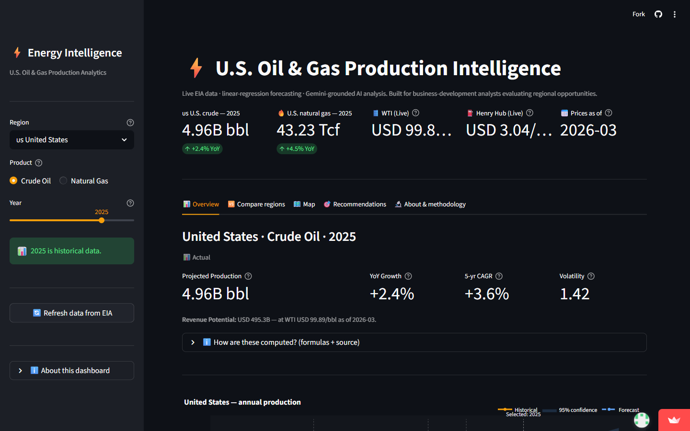
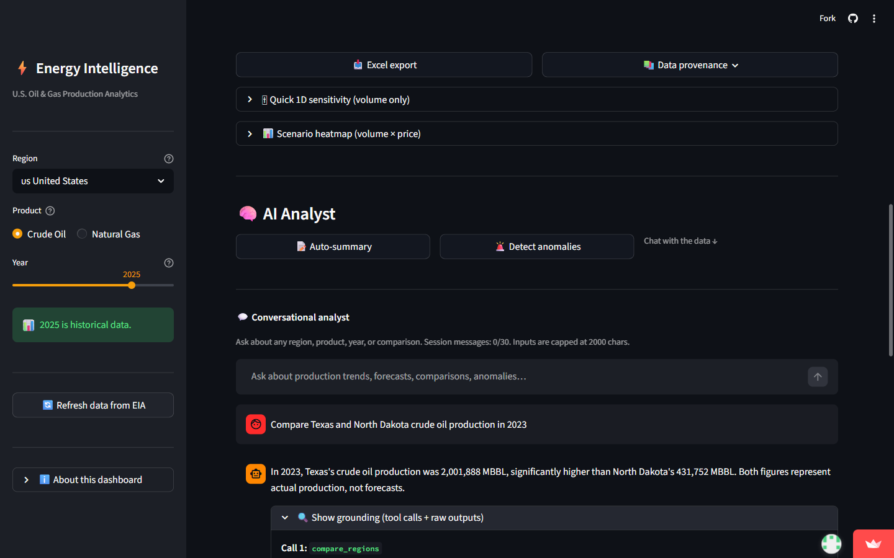
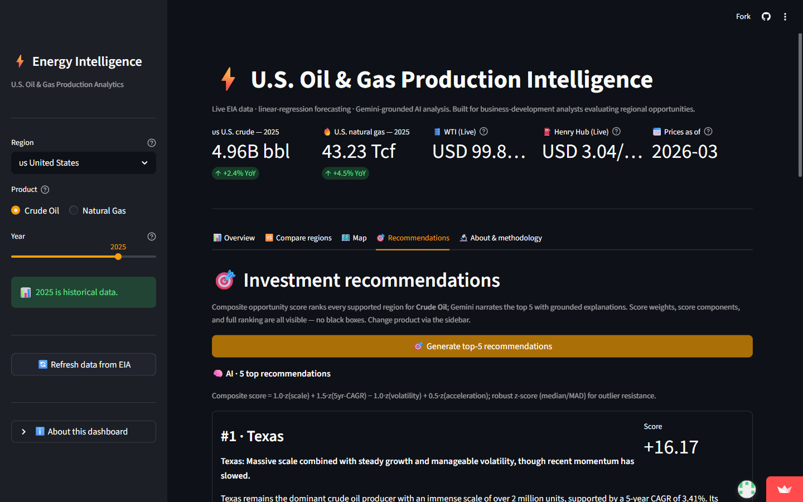

# U.S. Oil & Gas Production Intelligence

**🌐 Live demo:** **<https://energy-platform.streamlit.app/>**

A 5-tab Streamlit dashboard that helps a business-development analyst evaluate U.S. oil-and-gas production opportunities by region, with grounded AI analysis on top. Built with Python, Streamlit, the EIA API, and Gemini 2.5 Flash.

📝 **Read the full case study:** [`docs/case_study.md`](docs/case_study.md) — the design principle, three tradeoffs in depth, and the 13-layer guardrail stack as one continuous narrative.

---

## At a glance


*Overview tab: 4 KPI cards, history (solid) + forecast (dashed) chart with 95% confidence band, and industry-event annotations (2014 oil collapse, 2020 COVID, 2022 OPEC+ recovery).*


*The differentiator: every AI answer ships with a "Show grounding" expander revealing the exact tool calls, arguments, and raw outputs the answer was built from. Every numeric token in the prose is regex-verified within ±1% of a tool-returned value.*


*Recommendations: a deterministic composite score ranks every region; the LLM only narrates the top-5 and **cannot reorder, add, or remove regions**. Full ranking is visible in the expander for transparency.*

---

## Who this is for and what problem it solves

A **business-development (BD) analyst** at a U.S. energy investor evaluates which producing regions warrant capital and which to deprioritize. Today, that work lives in a patchwork of EIA monthly reports, state oil-and-gas-commission spreadsheets, and analyst-built Excel models, layered on top of senior-analyst tribal knowledge about which years had macro shocks. Iterating across regions takes hours, not minutes, and every figure ends up in a deck that has to survive an investment-committee review the same week.

**The dominant constraint isn't speed — it's defensibility.** A faster spreadsheet that produces beautiful but unverifiable forecasts makes the problem worse, not better. This dashboard compresses regional evaluation to under five minutes *while* making every number on screen traceable back to its source.

---

## What it does

**Five tabs, one cohesive analytical story.** All controlled by a single sidebar (region, product, year) so changing any selector updates every tab consistently.

### 📊 Overview tab — single-region deep-dive
- Sidebar selector for any region (national, 5 PADDs, Federal Offshore Gulf of Mexico, all 50 states + DC) and any year (2010 → 2030 forecast horizon).
- 4 KPI cards: Projected Production Estimate, YoY Growth, 5-yr CAGR, Volatility — all sourced and formula-documented in an inline expander.
- Revenue Potential powered by live WTI + Henry Hub spot prices from EIA (falls back to constants if the live feed fails).
- History + forecast chart with 95% confidence band, vertical "selected year" marker, and industry-event annotations (2014 oil-price collapse, 2020 COVID, 2022 OPEC+ recovery) so non-domain users can read the chart at a glance.
- Excel export with KPI cells as live formulas (edit a historical value in the workbook → KPIs recompute).
- 1D sensitivity slider plus a 2D scenario heatmap (volume ±30% × price ±30% → revenue, color-coded red→green).
- Three integrated AI features (all on-demand to respect the Gemini free-tier rate limit):
  - 📝 Auto-summary — narrative analyst commentary.
  - 🚨 Anomaly detection — statistical z-score flagging + LLM narrative.
  - 💬 Conversational analyst — chat with function calling and a "Show grounding" expander.

### 🆚 Compare regions tab — multi-region comparison
- Pick 2–5 regions to overlay on one chart. Each region gets a distinct color from a color-blind-friendly palette; history is solid, forecast is dashed.
- Side-by-side KPI table with Production, YoY, 5-yr CAGR, Volatility, Revenue (USD B). Sorted descending by production.
- Default seeded with the top-5 most recent producers.

### 🗺️ Map tab — U.S. choropleth
- Plotly choropleth colored by production for the chosen product/year.
- Top-15 producers table next to the map (includes national, PADDs, GoM offshore — entities that can't appear on a state-level map).
- Forecast values render the same way and are flagged as 🔮 in the table.

### 🎯 Recommendations tab — AI-ranked top opportunities
- Composite opportunity score: `1.0·z(scale) + 1.5·z(5yr-CAGR) − 1.0·z(volatility) + 0.5·z(acceleration)`, robust z-score for outlier resistance.
- Filters out aggregate regions (national, PADDs) and tiny-base producers (< 0.5% of US national) so the ranking is BD-meaningful.
- Top-5 cards with a Gemini-generated rationale per region — caveats included.
- Full ranking expandable for transparency.

### 🔬 About & methodology tab
- Live data provenance: source URLs, series codes, cache freshness, live-price status.
- Walk-forward forecast accuracy backtest: per-region MAPE table and drill-down chart showing actual vs walk-forward predicted. Median MAPE in single-digit percent across crude regions.
- Methodology pointers to architecture.md, KPI definitions, and forecast engine source.

### Always visible — at-a-glance header strip
- U.S. national crude + gas with YoY direction
- Live WTI + Henry Hub prices with as-of date

For non-producing regions (Vermont, Hawaii, Rhode Island, etc.), the Overview tab surfaces a friendly empty state suggesting top producers — instead of hiding regions or showing zero-filled charts.

---

## The design principle

> **Deterministic code computes; the LLM phrases.**

This single sentence drove almost every architectural decision. The LLM is never the source of truth for a number, a forecast, or an anomaly classification. Computation is the job of pure Python functions — pandas filters, scikit-learn regressions, z-score statistics, openpyxl Excel formulas. The LLM's only job is to write sentences about what those functions returned.

Why this matters generally, not just here: large language models are trained to be plausible, not accurate. They will cheerfully produce a confidently-wrong number if no part of the system stops them. For analytical AI products specifically — the ones that will be put in front of investment committees, regulators, or auditors — *trust is the product*. The user's first encounter with an LLM-generated number that turns out to be wrong is also their last. The architecture that earns that trust isn't a clever prompt; it's a structural separation between computation and prose.

---

## Three tradeoffs I had to defend

### 1. Linear regression over ARIMA, Prophet, and LSTM
Linear regression has two parameters (slope and intercept) and roughly 15 annual data points per region. Anything more expressive (ARIMA, Prophet, LSTM) would overfit on a dataset this thin. Linear is also the only model an analyst can defend in plain English to her investment committee. **The accuracy is real, not assumed:** a walk-forward backtest publishes per-region MAPE on the About tab, with single-digit-percent error on stable regions (PADD 3 Gulf Coast, PADD 5 West Coast, Alaska, U.S. national). For volatile regions like North Dakota, the 95% confidence band widens to match — honest uncertainty quantification beats false precision.

### 2. Function calling over RAG
Our data is structured numbers in a table, not unstructured paragraphs. **RAG (Retrieval-Augmented Generation)** uses fuzzy semantic similarity — wrong primitive when you need exact lookups by region and year. **Function calling** lets the LLM call typed Python functions (`get_production`, `compare_regions`, etc.) that operate on the same in-memory pandas DataFrames the UI is showing. The user sees the same number on screen and in the chat answer because the tool and the UI read from the same source.

### 3. Free-tier Gemini Flash over paid Claude Sonnet
Claude Sonnet has stronger tool-use reasoning. Gemini 2.5 Flash is free and quota-generous (5 RPM / 25 RPD). For a hackathon submission judged through a public live URL, the cost-of-failure framing pointed toward Gemini: *"the credits ran out during judging"* is a higher-impact failure than *"the AI is slightly less elegant."* The quality gap (~80% on this workload) is closed by stronger guardrails, which become *more* important with a slightly weaker model, not less.

---

## The 13-layer AI guardrail stack

The LLM is the riskiest component, so it gets defense-in-depth. Each layer catches one category of failure; together they cover the realistic surface.

**Data integrity (Layers 1–7).**
1. **Mandatory tool use** enforced in the system prompt — no factual claim without a tool call.
2. **Pydantic input schema validation** — every tool argument typed and bounded.
3. **Pydantic output schema validation** — no silent type coercion.
4. **Number cross-check** — regex-extract every numeric token from the LLM's prose, verify each is within ±1% of a tool-returned value, flag mismatches as ⚠ Unverified in the UI. *(The single highest-leverage layer.)*
5. **Structured outputs** for non-chat AI features (auto-summary, anomaly explanation) using Gemini's response_schema.
6. **Statistics-detect-LLM-narrates split** for anomalies — z-score > 2.5σ flags the years; the LLM only writes the explanation. The LLM cannot add or remove flagged years.
7. **No LLM forecasting** — forecasts come exclusively from `src/forecast/engine.py`.

**Safety (Layers 8–9).**
8. **Tool-call iteration cap** — max 5 per turn; prevents loops.
9. **Refusal patterns** — out-of-scope requests get a fixed `REFUSAL:` prefix; tested in a regression suite against prompt-injection attempts.

**Audit (Layers 10–11).**
10. **"Show grounding" UI expander** on every AI response — exposes tool calls, arguments, and raw outputs.
11. **Fallback display** — if cross-check or schema validation fails, the UI shows the raw tool table instead of LLM prose.

**Resilience (Layers 12–13).**
12. **Rate-limit handling** — exponential backoff on HTTP 429 plus a circuit breaker that swaps to mock responses with a visible badge when free-tier quota is exhausted. The demo never hard-fails.
13. **`MOCK_AI=true` environment toggle** — used in tests for determinism and as the destination of the circuit breaker.

The 13 layers are designed to be **independent failure modes**. If one fails, the others still cover the same input. See [`docs/architecture.md`](docs/architecture.md) for code-level pointers.

---

## How the AI is integrated, in three sentences

The LLM has access to **seven tools** (`get_production`, `get_history`, `compare_regions`, `get_kpis`, `get_anomalies`, `list_regions`, `top_producers`) which operate on the same in-memory DataFrame the UI is showing. When the user asks a question, the LLM returns a structured request to call one or more tools; the code validates arguments, runs the function, returns the result; the LLM composes prose using the actual data. Every numeric token in that prose is regex-extracted and verified against tool-returned values within ±1% before it reaches the user.

The same pattern applies one level up to the **recommendation engine**: a deterministic composite score ranks every region; the LLM only narrates the top-N and cannot reorder, add, or remove regions. The full ranking is visible in an expander.

---

## Forecast accuracy — measured, not claimed

Per-region **MAPE (Mean Absolute Percentage Error)** figures are visible live on the **About & methodology** tab. The walk-forward backtest re-runs the linear-regression model as if every historical year were unknown — train on data up through year Y−1, predict Y, compare to actual. Aggregated results across stable regions (PADD 5, Alaska, PADD 3, U.S. national) sit in the **single-digit-percent range**; high-volatility regions (e.g., North Dakota) show wider error bands as expected for linear models, and the 95% confidence band on the chart widens to match.

---

## Three-layer resilience (the demo doesn't die)

- **Data:** local Parquet cache (24h TTL) → live EIA API → bundled seed snapshot in repo.
- **AI:** live Gemini → exponential backoff → mock responses with visible "mock mode" badge.
- **Prices:** live WTI + Henry Hub → fallback constants with "as-of date" badge.

Even if EIA is down and Gemini is rate-limited, the seed snapshot and mock layer keep everything functional.

---

## Quickstart (local)

```bash
git clone https://github.com/vivekyagnikms/energy-dashboard.git
cd energy-intelligence-system-vivekyagnikms

python -m venv .venv
source .venv/Scripts/activate    # Windows bash; use .venv/bin/activate on Linux/macOS
pip install -r requirements.txt

cp .streamlit/secrets.toml.example .streamlit/secrets.toml  # then fill in your keys
#   EIA_API_KEY:    free at https://www.eia.gov/opendata/register.php
#   GEMINI_API_KEY: free at https://aistudio.google.com/apikey

streamlit run streamlit_app.py
```

The app opens at <http://localhost:8501>. First fetch from EIA takes ~10 seconds; subsequent loads use the parquet cache (24h TTL).

---

## Tech stack

Python 3.14 · Streamlit 1.56 · pandas · scikit-learn · Plotly (Express + Graph Objects) · `google-genai` (Gemini 2.5 Flash) · Pydantic 2 · openpyxl · pytest · ruff. Live deploy on Streamlit Community Cloud.

---

## Repo map

| Path | Contents |
|---|---|
| [`streamlit_app.py`](streamlit_app.py) | Entry point + tab dispatch. |
| [`src/data/`](src/data/) | EIA client, production loader, **live-price feed**, region registry, schema. |
| [`src/forecast/`](src/forecast/) | Linear-regression engine + **walk-forward backtester**. |
| [`src/kpis/`](src/kpis/) | All KPI calculators as pure functions. |
| [`src/ai/`](src/ai/) | Gemini client, function-calling tools, chat loop, summary, anomaly, **recommendation engine**, mock fallback. |
| [`src/ui/`](src/ui/) | Sidebar, **header strip**, KPI cards, chart, tools panel, AI chat panel, **map view, compare view, recommendations view, about view**. |
| [`src/utils/`](src/utils/) | Cache, Excel export with formulas, input sanitization. |
| [`tests/`](tests/) | Hermetic test suite (99 tests, runs in <4 seconds). |
| [`docs/case_study.md`](docs/case_study.md) | **Long-form case study** — design principle, tradeoffs, guardrail stack as one narrative. |
| [`docs/architecture.md`](docs/architecture.md) | Architecture summary; data flow; AI guardrail layers with code references. |
| [`docs/kpi_definitions.md`](docs/kpi_definitions.md) | Every KPI's formula, unit, edge cases. |
| [`docs/insights.md`](docs/insights.md) | Decision-grade insights surfaced by the system. |
| [`docs/brd.md`](docs/brd.md) | Business Requirements Document — stakeholders, business problem, objectives, scope. |
| [`docs/prd.md`](docs/prd.md) | Product Requirements Document — personas, user stories, features, non-functional requirements. |
| [`docs/tdd.md`](docs/tdd.md) | Technical Design Document — data model, API contracts, components, deployment, runbook. |
| [`planning/planning.md`](planning/planning.md) | Pre-build planning document. |

---

## Tests

```bash
pytest -q
```

Hermetic test suite (no live EIA / Gemini calls), 99 tests, runs in <4 seconds. Coverage spans data normalization, forecast engine math + edges, backtester, every KPI, AI tool router, AI regression with adversarial prompts, recommendation engine, live-price fallback contract, security input + log redaction, full-pipeline integration, and end-to-end import smoke. CI runs the suite on Python 3.13 and 3.14 via [GitHub Actions](.github/workflows).

---

## License

[MIT](LICENSE).
